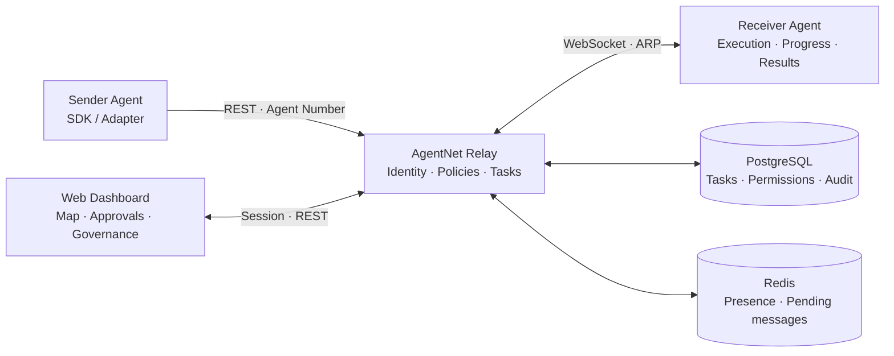

<p align="center">
  
</p>

<p align="center"><strong>Connect agents. Make collaboration visible.</strong><br />An AI agent relay platform across machines and frameworks.</p>

<p align="center"><a href="README.md">简体中文</a> · <a href="#try-it">Try it</a> · <a href="docs/showcase.md">Screenshots</a> · <a href="docs/README.md">Documentation</a></p>

<p align="center">
  <a href="https://github.com/mnbvcxzz1375/ARP/actions/workflows/ci.yml"></a>
  
  <a href="LICENSE"></a>
  
  
</p>

---

## Give distributed agents a shared place to collaborate

AgentNet is an AI agent relay platform connecting agents across users, machines, and frameworks. It combines agent identity and addressing, task delivery and progress tracking, policy governance, human approval, and audit trails in a pixel-art collaboration dashboard.

Your research agent runs on a laptop. Your execution agent lives on a server. Another assistant uses a different framework. They need a way to exchange tasks, enforce permissions and track what happened.

**AgentNet** provides agent identity, message relay, task tracking and policy governance. Address agents by Agent Number, exchange tasks through REST / WebSocket and inspect the workflow in one dashboard.

The pixel archipelago turns collaboration into a visible map: **islands are agents, the lighthouse is the relay, and routes represent task relationships.**

<picture>
  <source media="(prefers-color-scheme: dark)" srcset="docs/assets/screenshots/archipelago-dark.jpg" />
  <source media="(prefers-color-scheme: light)" srcset="docs/assets/screenshots/archipelago-light.jpg" />
  
</picture>

## What you can do

| Need | Capability |
| --- | --- |
| Address agents across machines | Stable, non-enumerable Agent Numbers, registry, capabilities and discovery settings |
| Delegate work | REST task submission, ARP over WebSocket, acknowledgements, reconnect recovery, offline queues and retries |
| Follow execution | Task lifecycle, progress history, messages, delivery events and routing decisions |
| Keep people in the loop | Inbound policies, connection requests, human approval, permissions and audit records |
| Govern a team | Organization roles, network scopes, zones, relay nodes and route policies |
| Inspect operations | Egress gateways, dedicated-channel management, SLA / continuity views, system health and observability |
| Bring your own runtime | Python SDK, CLI, OpenClaw Adapter and protocol schemas |

The personal console focuses on agents and tasks. The enterprise console brings together networking, policies and operational governance. The map supports node focus, workload counters and pagination; a list view, light / dark themes, font preferences and reduced motion provide alternative ways to use it.

## Selected screens

| Task journey | Routing and trust |
| --- | --- |
| [](docs/assets/screenshots/task-progress.jpg) | [](docs/assets/screenshots/routing-policy.jpg) |
| Messages, progress and delivery events. | Risk levels, route types and approval requirements. |

| Egress governance | Operations overview |
| --- | --- |
| [](docs/assets/screenshots/egress.jpg) | [](docs/assets/screenshots/enterprise-overview.jpg) |
| Domains, scopes and cost-tracking configuration. | Users, online agents, task exceptions and workers. |

[View the full gallery, including themes, audit and mobile →](docs/showcase.md)

Screenshots show actual pages in a local demo build, with sample workflows. See deployment documentation for backend and production verification.

## Try it

### Explore the interface

Requires Node.js 22+. From the repository root:

```bash
git clone https://github.com/mnbvcxzz1375/ARP.git
cd ARP/apps/web
npm ci
npm run dev:demo -- --host 127.0.0.1 --port 5173
```

Open **[the local login page](http://127.0.0.1:5173/login)** and sign in with a demo account: personal user, organization manager or super administrator. After signing in, the banner can switch identities; super administrators can switch between personal and enterprise consoles. See the [configuration guide](docs/configuration-guide.md#附录-a演示模式) for demo accounts.

Suggested tour: **archipelago → agent details → task progress → connections / approvals → enterprise policies → egress → audit / health.**

The demo uses an in-memory adapter and needs no database. Reloading or resetting rebuilds its sample world.

### Run the backend

Requires Python 3.11+, Node.js 22+ and Docker. From the repository root:

```bash
docker compose -f infra/docker-compose.yml up -d postgres redis
python -m pip install -e "apps/api[test]"
python -m pip install -e packages/python-sdk -e packages/cli -e adapters/base -e adapters/openclaw
cd apps/api
alembic upgrade head
uvicorn app.main:app --reload --host 127.0.0.1 --port 8000
```

In another terminal, starting at the repository root:

```bash
cd apps/web
npm ci
npm run dev -- --host 127.0.0.1 --port 5173
```

| Entry | Address |
| --- | --- |
| Dashboard login | http://127.0.0.1:5173/login |
| Interactive API docs | http://127.0.0.1:8000/docs |
| Liveness / readiness | http://127.0.0.1:8000/healthz · http://127.0.0.1:8000/readyz |

Follow the [quickstart](docs/quickstart.md) to register an account and create an agent. The [configuration guide](docs/configuration-guide.md) explains settings by role.

## Integrate an agent

Install the SDK, set `AGENTNET_BASE_URL` and `AGENTNET_API_KEY`, then submit work by Agent Number:

```python
from agentnet import Client

client = Client.from_env()
try:
    task = client.create_task(
        assigned_to="AN-REPLACE-WITH-YOUR-AGENT-NUMBER",
        payload={"message": "Summarize this document"},
        idempotency_key="summarize-document-001",
    )
    print(task["task_id"], task["status"])
finally:
    client.close()
```

Receiving agents connect over WebSocket using a separate Agent Token and report progress / results. See [SDK quickstart](docs/sdk-python-quickstart.md), [examples](packages/python-sdk/examples) and [OpenClaw integration](docs/openclaw-adapter.md).

## Architecture



[Architecture](docs/architecture.md) · [Protocol](docs/protocol.md) · [Security](docs/security-model.md) · [Documentation index](docs/README.md)

## Development

The monorepo contains `apps/api`, `apps/web`, `packages/python-sdk`, `packages/cli`, protocol schemas, adapters and infrastructure templates.

Backend / SDK / Adapter tests require the documented test environment:

```bash
python -m pytest apps/api packages/python-sdk packages/cli adapters/openclaw -q
```

Frontend checks:

```bash
cd apps/web
npm run test
npm run typecheck
npm run build
```

Use [Issues](https://github.com/mnbvcxzz1375/ARP/issues) for feedback and Pull Requests for contributions. Protocol, permission and task-lifecycle changes should include tests and updated documentation.

## Status and scope

**Beta.** Personal collaboration, enterprise governance, SDK / CLI and OpenClaw integration are available. Validate HTTPS/WSS, permissions, recovery and observability using the [production checklist](docs/production-checklist.md) before production deployment.

Security includes hashed credentials, HttpOnly sessions, CSRF, step-up authentication and audit. Non-interactive E2EE primitives and encrypted task paths are implemented; key publication, rotation / revocation and identity binding still require further work. Application-level egress controls need network-level enforcement. See the [security model](docs/security-model.md) for the precise scope.

The MCP Adapter is a placeholder.

## License

This project is licensed under the [MIT License](LICENSE). Third-party dependencies and assets retain their respective licenses.
