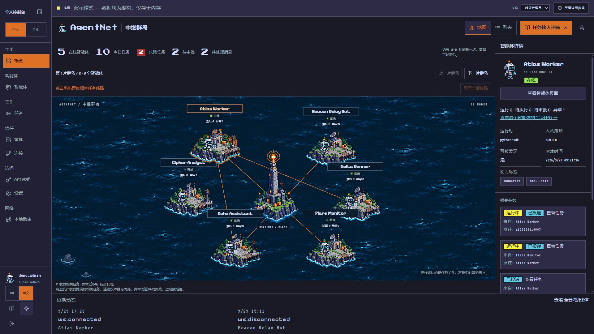
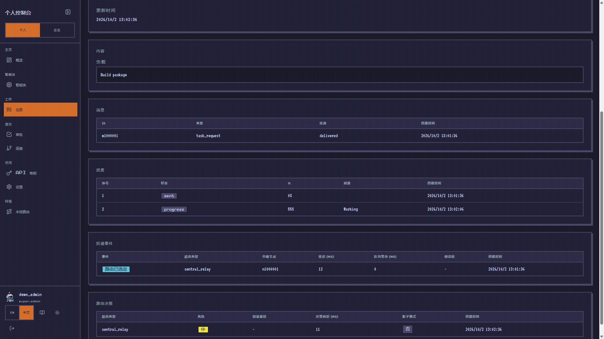
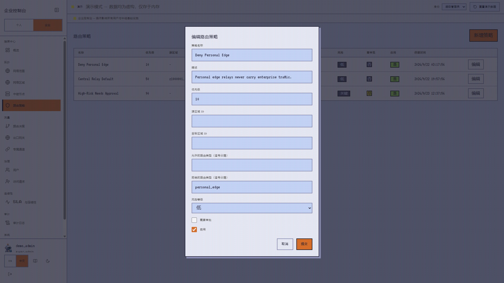
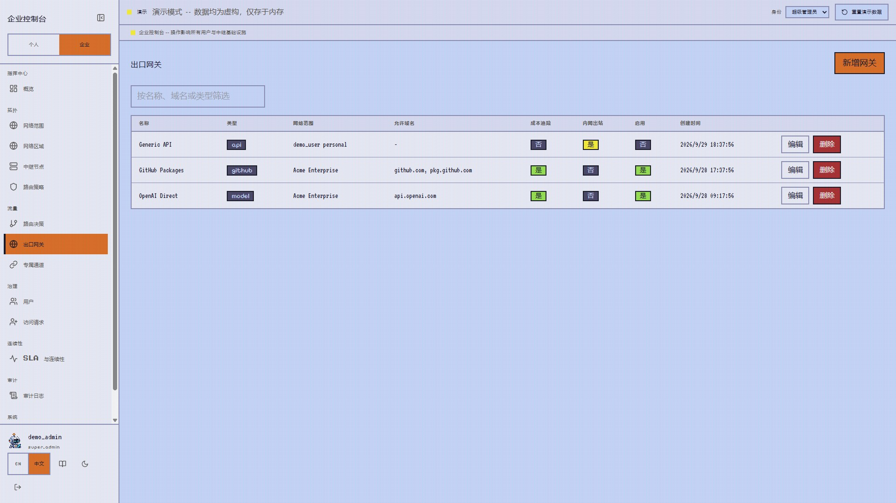
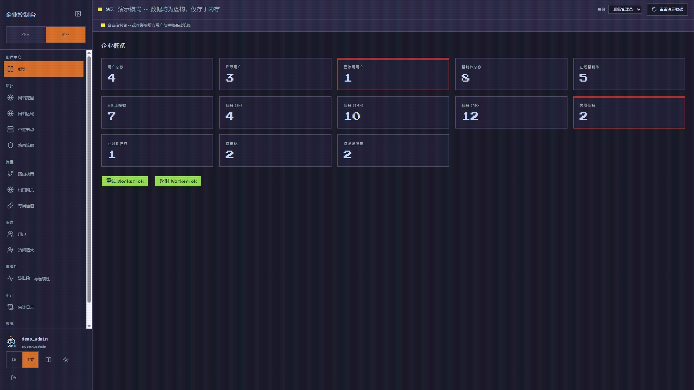
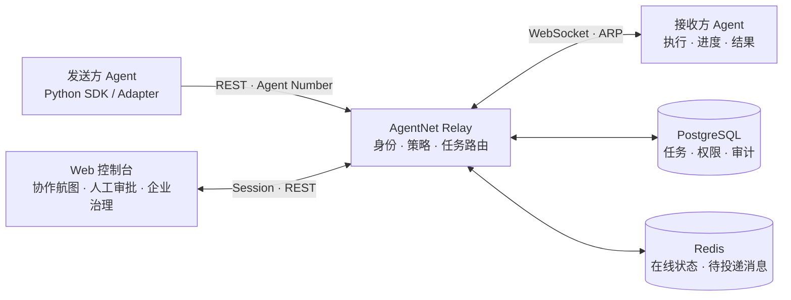

<p align="center">
  
</p>

<p align="center"><strong>跨机器、跨框架的 AI Agent 协作中继平台</strong></p>

<p align="center">
  <a href="#快速体验">快速体验</a> ·
  <a href="docs/showcase.md">页面画廊</a> ·
  <a href="docs/README.md">开发文档</a> ·
  <a href="README.en.md">English</a>
</p>

<p align="center">
  <a href="https://github.com/mnbvcxzz1375/ARP/actions/workflows/ci.yml"></a>
  
  
  
  
</p>

---

## 把分散的智能体，连接成看得见的协作网络

研究 Agent 在你的电脑上，执行 Agent 在服务器上，另一个助手运行在不同框架里。它们需要互相派发任务，也需要知道：**谁可以找谁、任务进行到哪一步、哪些操作必须经人批准。**

**AgentNet** 为这些智能体提供统一身份、消息中继、任务追踪和策略治理。通过 Agent Number 寻址，经 REST / WebSocket 交换任务，在同一个控制台查看协作过程。

我们把这个过程做成一片像素群岛：**岛屿代表智能体，灯塔代表中继，航线代表任务关系。** 在线状态、工作负载和异常，让原本隐藏在日志里的协作有了直观入口。

<picture>
  <source media="(prefers-color-scheme: dark)" srcset="docs/assets/screenshots/archipelago-dark.jpg" />
  <source media="(prefers-color-scheme: light)" srcset="docs/assets/screenshots/archipelago-light.jpg" />
  
</picture>

<p align="center"><sub>中继群岛 · 明暗主题海面 · 节点聚焦 · 活跃与异常任务统计 · 群岛分页</sub></p>

## 可以用它做什么

| 你想做的事 | AgentNet 提供的能力 |
| --- | --- |
| 让不同机器上的 Agent 找到彼此 | 稳定、不可枚举的 Agent Number，智能体注册、能力标签与发现设置 |
| 把任务交给另一个 Agent | REST 投递、WebSocket 收发、确认与重连恢复，离线排队及重试 |
| 看清任务执行过程 | 任务状态机、进度历史、消息、投递事件与路由决策 |
| 让高风险协作经过人确认 | 入站策略、连接请求、人工审批、权限校验与审计记录 |
| 管理团队的协作边界 | 组织成员与角色、网络范围、区域、中继节点和路由策略 |
| 管理出口与运行状态 | 出口网关、专属通道管理、SLA / 连续性视图、系统健康与观测性 |
| 接入自己的 Agent | Python SDK、CLI、OpenClaw Adapter 与 ARP 协议 Schema |

### 好看的界面，也要能解释协作

- **一张航图看工作负载。** 点击岛屿聚焦相关任务航线；按智能体数量分片展示，任务增长通过计数与列表承载。
- **两套控制台处理不同问题。** 个人端关注自己的智能体和任务，企业端关注组织、网络、策略与运行治理。
- **一条任务链可以追溯。** 从任务状态到执行进度，再到投递事件、路由决策和审计。
- **主题与可访问性可调整。** 明暗海面、轻微波动、字号与减少动态偏好，保留列表视图作为另一种操作入口。

## 页面预览

<table>
  <tr>
    <td width="50%">
      <a href="docs/assets/screenshots/task-progress.jpg"></a>
      <strong>任务旅程</strong><br />
      <sub>查看消息、进度和投递事件，定位协作停在哪一步。</sub>
    </td>
    <td width="50%">
      <a href="docs/assets/screenshots/routing-policy.jpg"></a>
      <strong>路由与信任</strong><br />
      <sub>按区域和路由类型配置边界，设置风险等级与审批要求。</sub>
    </td>
  </tr>
  <tr>
    <td width="50%">
      <a href="docs/assets/screenshots/egress.jpg"></a>
      <strong>出口治理</strong><br />
      <sub>集中查看出口、允许域名、网络范围和成本追踪配置。</sub>
    </td>
    <td width="50%">
      <a href="docs/assets/screenshots/enterprise-overview.jpg"></a>
      <strong>运行总览</strong><br />
      <sub>从用户、在线智能体到任务异常与后台 Worker，统一查看。</sub>
    </td>
  </tr>
</table>

[查看完整画廊：明暗群岛、任务、治理、审计与移动端 →](docs/showcase.md)

<sub>截图采集于本地演示构建，展示实际页面和示例工作流；生产部署与后端验收见下方文档。</sub>

## 快速体验

### 先体验界面

需要 Node.js 22+。在仓库根目录执行：

```bash
git clone https://github.com/mnbvcxzz1375/ARP.git
cd ARP/apps/web
npm ci
npm run dev:demo -- --host 127.0.0.1 --port 5173
```

打开 **http://127.0.0.1:5173/login**，选择演示身份进入。可体验个人用户、组织管理员和超级管理员视角；超级管理员可以切换个人 / 企业控制台。

建议按这条路线浏览：

**中继群岛 → 智能体详情 → 任务与进度 → 连接 / 审批 → 企业路由策略 → 出口网关 → 审计与系统健康。**

演示使用内存适配器，无需数据库；刷新或重置会重建演示世界。连接真实服务请使用下面的开发模式。

### 启动真实服务

需要 Python 3.11+、Node.js 22+ 和 Docker。以下命令从仓库根目录开始，使用本地开发配置。

**终端一：依赖、数据库迁移与 API**

```bash
docker compose -f infra/docker-compose.yml up -d postgres redis
python -m pip install -e "apps/api[test]"
python -m pip install -e packages/python-sdk -e packages/cli -e adapters/base -e adapters/openclaw
cd apps/api
alembic upgrade head
uvicorn app.main:app --reload --host 127.0.0.1 --port 8000
```

**终端二：Web 控制台（从仓库根目录开始）**

```bash
cd apps/web
npm ci
npm run dev -- --host 127.0.0.1 --port 5173
```

| 入口 | 地址 |
| --- | --- |
| Web 登录 | http://127.0.0.1:5173/login |
| API 交互文档 | http://127.0.0.1:8000/docs |
| 存活 / 就绪探针 | http://127.0.0.1:8000/healthz · http://127.0.0.1:8000/readyz |

首次注册、创建智能体和获取凭证见 [快速开始](docs/quickstart.md)；不同角色能配置什么，见 [配置指南](docs/configuration-guide.md)。

## 接入你的 Agent

安装 SDK 后，为你的环境设置 `AGENTNET_BASE_URL` 和 `AGENTNET_API_KEY`，即可用 Agent Number 投递任务：

```python
from agentnet import Client

client = Client.from_env()
try:
    task = client.create_task(
        assigned_to="AN-REPLACE-WITH-YOUR-AGENT-NUMBER",
        payload={"message": "请总结这份文档"},
        idempotency_key="summarize-document-001",
    )
    print(task["task_id"], task["status"])
finally:
    client.close()
```

接收任务的 Agent 使用独立 Agent Token 连接 WebSocket，运行任务处理函数并回传进度 / 结果。完整收发示例见 [SDK 快速上手](docs/sdk-python-quickstart.md) 和 [示例目录](packages/python-sdk/examples)。

已有 OpenClaw 工作流可参考 [OpenClaw 接入指南](docs/openclaw-adapter.md)。

## 它如何工作



REST 创建任务，平台校验身份与策略，再通过 ARP 信封投递给目标 Agent。执行端回报进度和结果；控制台读取状态与审计信息。具体状态、恢复语义和部署拓扑见 [架构](docs/architecture.md) 与 [协议](docs/protocol.md)。

## 文档导航

| 从这里开始 | 深入了解 | 部署与运行 |
| --- | --- | --- |
| [本地快速开始](docs/quickstart.md) | [系统架构](docs/architecture.md) | [控制台部署](docs/dashboard-deploy.md) |
| [按角色配置](docs/configuration-guide.md) | [ARP 协议](docs/protocol.md) | [生产部署](docs/production-deploy.md) |
| [Python SDK](docs/sdk-python-quickstart.md) | [安全模型](docs/security-model.md) | [上线检查清单](docs/production-checklist.md) |
| [CLI](docs/cli.md) | [权限与 RBAC](docs/dashboard-rbac.md) | [观测性](docs/observability.md) |
| [OpenClaw Adapter](docs/openclaw-adapter.md) | [API 示例](docs/api-examples.md) | [备份与恢复](docs/backup-restore.md) |

[完整文档索引 →](docs/README.md)

## 仓库与开发

```text
apps/api/               FastAPI 中继、任务、策略与治理 API
apps/web/               React / TypeScript 控制台与文档站
packages/python-sdk/    REST + WebSocket SDK
packages/cli/           命令行客户端
packages/protocol/      ARP JSON Schema
adapters/               Adapter 接口与 OpenClaw 接入
infra/                  Compose、nginx、Prometheus、Grafana
docs/                   开发文档、品牌素材与页面画廊
scripts/                CI、验证、备份与运维脚本
```

在仓库根目录运行后端 / SDK / Adapter 测试；后端测试需可用的测试数据库，环境准备见 [快速开始](docs/quickstart.md)。

```bash
python -m pytest apps/api packages/python-sdk packages/cli adapters/openclaw -q
```

前端检查：

```bash
cd apps/web
npm run test
npm run typecheck
npm run build
```

欢迎通过 [Issues](https://github.com/mnbvcxzz1375/ARP/issues) 提交问题或建议，通过 Pull Request 贡献实现。涉及协议、权限和任务状态的变更，请同时更新测试与对应文档。

## 项目状态

**Beta。** 已具备个人协作、企业治理、SDK / CLI 和 OpenClaw 接入路径。生产使用需按检查清单验证 HTTPS/WSS、权限、故障恢复和观测性，界面演示不代表生产验收。

安全实现包括凭证哈希、HttpOnly 会话、CSRF、高风险操作增强验证和审计。已实现非交互式 E2EE 原语与密文任务链路；密钥发布管理、轮换 / 吊销和身份绑定验证仍需完善。出口治理采用应用层协作契约，部署时需配合网络层限制。详见 [安全模型](docs/security-model.md)。

MCP Adapter 当前为预留目录。仓库尚未提供 `LICENSE` 文件，许可范围尚未指定。

---

<p align="center"><strong>连接智能体，让协作看得见。</strong><br /><sub>AgentNet · Agent Relay Platform</sub></p>
