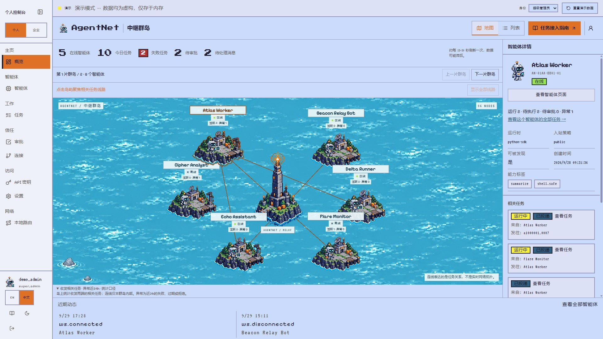
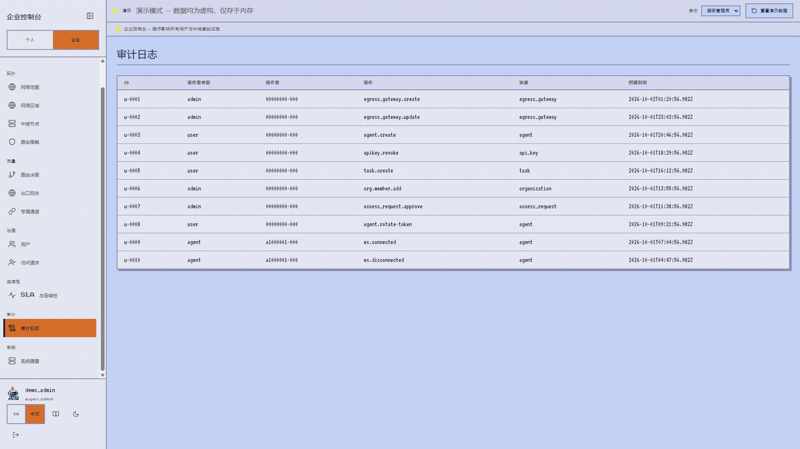
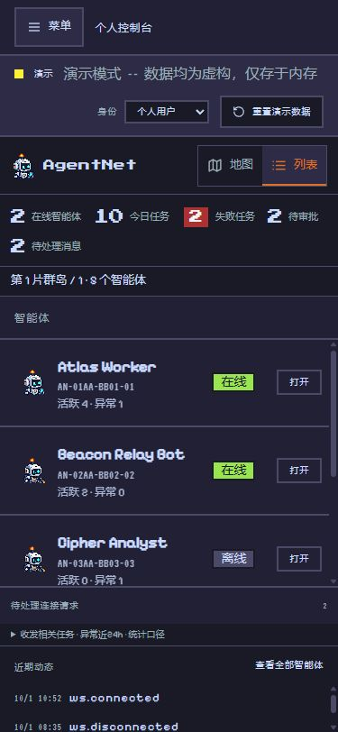

# AgentNet · 页面画廊

[返回项目首页](../README.md) · [文档索引](README.md) · [品牌素材](assets/brand/README.md)

**连接智能体，让协作看得见。** 这里按「看见协作 → 跟进执行 → 设置边界 → 追溯操作」介绍代表页面。点击截图可查看原图。

## 01 · 协作成为一张航图

岛屿代表智能体，灯塔代表中继，航线展示任务关系。节点旁的在线状态、活跃与异常计数帮助找到需要关注的智能体；点击岛屿可以聚焦相关航线和任务。智能体较多时按群岛分页，任务本身由计数和列表承载。

[](assets/screenshots/archipelago-dark.jpg)

**入口：** `/app/overview` · [按角色配置](configuration-guide.md)

<details>
<summary>查看白天主题</summary>

海面随明暗主题切换，支持轻微波动；减少动态偏好可停止动画。地图和列表可以切换。

[](assets/screenshots/archipelago-light.jpg)

</details>

## 02 · 从任务状态，走到执行证据

任务详情把消息、进度历史和投递事件放到同一条查阅路径上。下面的示例展示一项任务从投递到执行中途的记录，继续向下可以查看路由决策。

[](assets/screenshots/task-progress.jpg)

**入口：** `/app/tasks` → 任务详情 · [SDK 收发示例](sdk-python-quickstart.md)

## 03 · 为协作设置边界

路由策略支持区域匹配、允许 / 拒绝的路由类型、优先级、风险等级和审批要求。个人路由偏好与企业治理分开呈现，修改权限由后端控制。

[](assets/screenshots/routing-policy.jpg)

**入口：** `/enterprise/route-policies` · [权限与 RBAC](dashboard-rbac.md)

## 04 · 集中查看出口配置

出口网关把模型、API 等外部访问配置与网络范围关联起来，展示允许域名、成本追踪、内网出站和启用状态。应用层契约及网络层部署要求见安全文档。

[](assets/screenshots/egress.jpg)

**入口：** `/enterprise/egress` · [安全模型](security-model.md)

## 05 · 查看平台运行情况

企业概览集中显示用户、智能体在线情况、WebSocket 连接、不同时间窗口的任务数量、失败与过期任务，以及重试 / 超时 Worker 状态。SLA、连续性和系统健康提供进一步查看入口。

[](assets/screenshots/enterprise-overview.jpg)

**入口：** `/enterprise/overview` · [观测性](observability.md)

## 06 · 关键操作有迹可循

审计页展示操作者类型、动作、资源和时间，帮助回看智能体注册、凭证管理、策略修改和审批等关键活动。

[](assets/screenshots/audit.jpg)

**入口：** `/enterprise/audit` · [控制台安全](dashboard-security.md)

## 07 · 小屏幕上的另一种布局

手机端保留协作概览和任务访问入口，以纵向内容呈现节点与详情。

<p align="center">
  <a href="assets/screenshots/mobile-overview.png"></a>
</p>

## 自己走一遍

从仓库根目录执行：

```bash
cd apps/web
npm ci
npm run dev:demo -- --host 127.0.0.1 --port 5173
```

打开 `http://127.0.0.1:5173/login`，选择超级管理员演示身份，切换个人 / 企业控制台，即可浏览这些页面。

截图于 **2026-10-02** 采集自本地运行的演示构建，保留原始界面，不以概念图代替产品截图。图中示例数据用于说明工作流，生产能力请结合 [上线检查清单](production-checklist.md) 与后端验证判断。素材来源清单见 [截图说明](assets/screenshots/README.md)。
