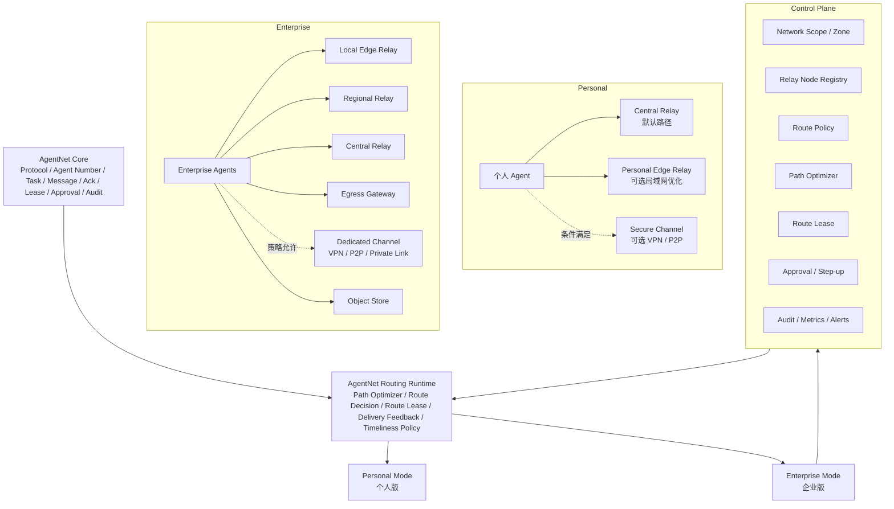

# AgentNet Personal + Enterprise Routing Runtime 完整计划

## Summary

本计划把 AgentNet 从“中心化 Relay 平台”升级为同时支持个人版和企业版的 **Routing Runtime**。两种形态共享核心协议、任务、消息、ack、lease、审批、审计、SDK 和 CLI；区别在于默认拓扑、策略复杂度、Dashboard 能力和治理强度。

目标是建立一套可靠 Agent 通信网络：

- 动态选择和优化路由。
- 明确反馈对方 Agent 是否收到、是否处理中、是否完成。
- 显式处理异常、超时、断线、Relay 故障。
- 保证业务连续性。
- 按任务时效性选择投递策略。
- 个人版保持简单，企业版提供完整治理。

## 第一性原理

1. **通信不是“发出去”就结束，而是一个可观测生命周期。**AgentNet 必须区分 queued、delivered、acked、received、accepted、running、completed、failed、expired 等状态。
2. **路由不是找最快路径，而是在约束下找最优路径。**权限、策略、风险、数据边界、审批、时效性必须先于延迟和成本。
3. **可靠性来自持久化事实，而不是内存状态。**任务状态、消息状态、Route Decision、Route Lease、ack、retry、timeout、fallback reason 必须可恢复、可审计。
4. **生产路径禁止兜底成功。**依赖缺失、Redis/Postgres/Relay/Egress/Adapter 失败、未实现功能、策略拒绝，都不能返回看似成功的默认结果。允许的例外只限测试 fake、资源清理二次异常、幂等 ack no-op。
5. **不接受最小验证或轻量验收。**每个 Phase 必须有真实文件交付、自动化测试、失败路径验证、文档更新、执行报告。不能只跑 happy path，也不能只证明“代码能启动”。
6. **每个 Phase 必须 review 到优秀。**Review 不能只看测试是否通过，还必须审查真实代码、数据模型、状态流、异常路径、审计记录、文档和用户体验是否真正解决本 Phase 描述的问题。
7. **异常必须显式化。**本地 Relay 失败后不能偷偷改走公网并显示成功。任何 reroute、fallback、retry、policy deny、lease expire 都必须有明确状态、错误码、审计和指标。
8. **个人版需要简单，企业版需要治理，但底层运行时必须一致。**Personal 暴露“快速 / 普通 / 可靠”；Enterprise 暴露 Scope、Zone、Route Policy、Route Lease、Egress、SLA 和完整审计。
9. **VPN / P2P / Private Link 是可选传输路径，不是权限豁免。**专属通道只有在双方授权、策略允许、健康检查通过、Route Lease 有效时才能使用。
10. **时效性决定投递策略。**
    实时任务宁可超时失败，也不应长期排队；耐久任务可以持久化排队、重试和恢复。

## Key Architecture



## Implementation Changes

### Shared Routing Runtime

- 新增 `RouteDecision`：记录选择线路、候选线路、拒绝原因、fallback 原因、timeliness、risk、score、trace_id。
- 新增 `RouteLease`：临时通信授权，包含 source_agent、target_agent、route_type、expires_at、max_messages、max_bytes、allowed_task_types、approval_id、revoked_at。
- 新增 `MessageDeliveryEvent`：记录 queued、route_selected、delivering、delivered、acknowledged、delivery_failed、expired。
- 新增 `RelayNode`：记录 central、personal_edge、local_edge、regional、egress、dedicated 的健康状态、负载、队列、延迟和能力。
- 新增 `RouteMetricEvent`：记录 latency、queue_wait、delivery_attempts、fallback、error_code、egress_bytes、policy_denied_count。
- 保留现有 Task、Message、Approval、Audit、ack、retry、session.resume、task lease；新增事件和决策表增强可观测性。

### Routing Selection

硬过滤顺序：

1. 身份认证。
2. Agent 是否存在且未禁用。
3. Connection Policy。
4. Route Policy。
5. 风险等级和审批状态。
6. 数据边界和外部出网规则。
7. Route Lease 是否可签发。
8. Relay / channel 是否健康。

评分维度：

- latency_ms。
- relay_load。
- queue_depth。
- delivery_success_rate。
- failure_rate。
- locality。
- cost_score。
- timeliness_mode。
- security_score。

默认规则：

- Personal 默认 `central_relay`。
- Personal 同机或同局域网可优先 `personal_edge_relay`。
- Enterprise 默认按 `local_edge -> regional -> central -> egress` 选择。
- Dedicated Channel 只在显式启用且健康时进入候选。
- 策略禁止的路径不能 fallback 成功。

### Timeliness Policy

Task Create 扩展：

```text
timeliness_mode: realtime | interactive | normal | batch | durable
ttl_seconds
deadline_at
priority
max_retry_count
retry_policy
route_policy_hint
```

默认值：

- Personal 默认 `normal`。
- Enterprise 默认由 Route Policy 决定，未配置时为 `normal`。
- Personal UI 只暴露：快速 = interactive，普通 = normal，可靠 = durable。
- Enterprise UI 暴露完整字段和策略模板。

### Delivery Feedback

Message Delivery State：

```text
queued
route_selected
delivering
delivered
acknowledged
delivery_failed
expired
```

Task Execution State：

```text
created
waiting_approval
approved
assigned
received
accepted
running
progress
waiting_input
succeeded
failed
cancelled
expired
```

Dashboard 和 REST task detail 必须展示 delivery timeline、execution timeline、route decision。

### Business Continuity

必须持久化：

- task status。
- message delivery status。
- route decision。
- route lease。
- message delivery events。
- retry_count。
- next_retry_at。
- last_error_code。
- fallback_reason。
- audit_trace_id。

新增 worker：

- Route health worker。
- Route retry worker。
- Route lease expiry worker。
- Route metrics aggregation worker。

故障策略：

- Redis down：不能假装 Agent 在线。
- Postgres down：不能创建任务或返回成功。
- Relay down：policy 允许才 reroute，否则 fail closed。
- Egress down：外部任务失败或等待，不允许 Agent 绕过网关。
- Dedicated Channel down：记录 channel_unavailable，按 policy 决定 fail 或 reroute。

### Personal Mode

- 每个用户默认一个隐式 `personal_scope`。
- 默认路径是 `central_relay`。
- 可选启用 `personal_edge_relay` 做局域网优先。
- 可选启用 `personal_secure_channel`，支持 VPN / P2P，但必须显式配对。
- 首次配对需要用户确认设备指纹。
- UI 展示简单状态：已排队、已送达、对方已确认、正在处理、完成、失败原因。
- 不暴露复杂 Route Policy。

### Enterprise Mode

- 显式支持 `NetworkScope`、`NetworkZone`、`RelayNode`、`RoutePolicy`。
- 支持 local edge、regional、central、egress、dedicated channel。
- 外部访问必须走 Egress Gateway。
- 高风险路由必须支持 Approval / Step-up。
- Route Lease 必须绑定审批、策略和审计。
- Dashboard 新增 Network Overview、Relay Nodes、Route Policies、Route Decisions、Delivery Timeline、Egress Logs、Dedicated Channels、SLA / Alerts。
- Admin 能查看 route decision，但不能看到 secret、token、完整敏感 payload。

## Public API / Interface Changes

新增或扩展 REST API：

```text
GET  /v1/routes/decisions
GET  /v1/routes/decisions/{route_decision_id}
GET  /v1/routes/policies
POST /v1/routes/policies
PATCH /v1/routes/policies/{policy_id}

GET  /v1/relay-nodes
POST /v1/relay-nodes/register
POST /v1/relay-nodes/{relay_node_id}/heartbeat

GET  /v1/tasks/{task_id}/delivery-events
GET  /v1/tasks/{task_id}/route-decisions
GET  /v1/dashboard/network/overview
GET  /v1/dashboard/admin/network/overview
GET  /v1/dashboard/admin/egress-logs
```

扩展 Agent WebSocket session metadata：

```text
scope_id
zone_id
relay_node_id
transport_capabilities
rtt_ms
supported_channels
client_mode: personal | enterprise
```

扩展 SDK：

- 自动上报 rtt、transport capability、session health。
- 暴露 delivery callback。
- 暴露 task execution callback。
- 支持 timeliness 参数。
- 支持 personal edge discovery 配置，但默认不开启专属通道。

## Rollout Phases

### Phase 12: Routing Runtime Foundation

- 增加 RouteDecision、RouteLease、MessageDeliveryEvent、RelayNode、RouteMetricEvent。
- Path Optimizer 先以 shadow mode 运行：记录决策，不改变现有投递路径。
- Dashboard task detail 显示 delivery timeline。
- 交付 migration、schema、API、测试、文档和 `reports/phase12_report.md`。
- Review 必须确认 shadow decision 与真实代码路径一致，而不是只确认表能创建。

### Phase 13: Enforced Routing Runtime

- Path Optimizer 接管任务投递。
- 保留现有 central relay 行为作为默认 route。
- route failure、fallback、policy deny 全部显式记录。
- retry worker 改为 route-aware。
- 交付测试、失败路径验证、文档和 `reports/phase13_report.md`。
- Review 必须检查真实投递链路是否经过 Path Optimizer。

### Phase 14: Personal Local-first Routing

- 增加 Personal Scope。
- 增加 Personal Edge Relay 注册和 heartbeat。
- 支持同局域网优先。
- 支持“快速 / 普通 / 可靠”。
- 可选 secure channel 只做注册和健康状态，不默认启用。
- 交付测试、失败路径验证、文档和 `reports/phase14_report.md`。
- Review 必须验证个人版没有被企业复杂配置拖重，同时本地优先真实生效。

### Phase 15: Enterprise Topology-aware Routing

- 增加 Network Scope / Zone / Route Policy。
- 支持 local edge、regional、central 选路。
- 增加企业 Network Dashboard。
- 支持 Route Lease 与 Approval 绑定。
- 交付测试、失败路径验证、文档和 `reports/phase15_report.md`。
- Review 必须确认策略拒绝不会被 fallback 绕过。

### Phase 16: Egress Gateway

- 外部 API、模型、GitHub、MCP、部署平台统一出网。
- 支持 domain allowlist、secret 隔离、限流、缓存、成本统计。
- 外部上传、部署、删除、secret 修改强制审批或 step-up。
- 交付测试、失败路径验证、文档和 `reports/phase16_report.md`。
- Review 必须确认 Agent 无法绕过 Egress Gateway 使用企业 secret。

### Phase 17: Dedicated Channel

- 支持 VPN / P2P / Private Link 作为 dedicated channel。
- 仅在双方授权、策略允许、健康检查通过、lease 有效时可用。
- 不允许绕过审批、审计和 egress policy。
- 失败后按 policy 显式 fail 或 reroute。
- 交付测试、失败路径验证、文档和 `reports/phase17_report.md`。
- Review 必须确认专属通道只是 transport，不是权限豁免。

### Phase 18: SLA / Observability / Business Continuity

- 增加 route latency、fallback rate、ack timeout、processing timeout、egress failure、SLA violation 指标。
- 增加长时间稳定性测试和故障注入。
- 增加 Redis、Postgres、Relay、Worker、Egress、Dedicated Channel 故障演练。
- 增加业务连续性报告和恢复 runbook。
- 交付测试、演练记录、文档和 `reports/phase18_report.md`。
- Review 必须确认业务连续性不是文档口号，而是故障后状态可恢复、可解释、可审计。

## Phase Review Gate

每个 Phase 完成后必须进入 Review Gate，未达到优秀不得进入下一 Phase。

Review 内容：

- 真实代码是否实现本 Phase 描述的能力。
- 数据模型是否能支撑业务恢复和审计。
- API / SDK / Dashboard 是否展示真实状态，而不是 mock 或占位。
- 失败路径是否真实触发并有测试。
- 是否存在兜底成功、静默放行、未实现却返回成功。
- 是否有 audit log、metric、error_code。
- 文档是否和代码一致。
- 是否有迁移、回滚、兼容性说明。
- 是否有安全泄露风险。
- 是否影响现有 Phase 0-11 行为。

每个 Phase 报告必须包含：

```text
reports/phaseXX_report.md
```

报告至少包含：

- 新增和修改文件。
- 执行过的命令。
- 测试结果。
- 失败路径验证结果。
- 真实代码审查结论。
- 文档更新。
- 未完成项。
- 风险和后续建议。
- 是否允许进入下一 Phase。

## Test Plan

### Unit Tests

- Path Optimizer 硬过滤顺序正确。
- 策略禁止路径不能被评分阶段重新选中。
- timeliness_mode 生成正确 TTL、priority、retry 策略。
- Route Lease 超时、撤销、超量消息、超量 bytes 都失败。
- MessageDeliveryEvent 事件顺序合法。
- Dedicated Channel 未授权、未健康、未启用时不可进入候选。

### Integration Tests

- Central Relay 默认路径保持兼容。
- Agent 在线时 delivery event 从 queued 到 acknowledged。
- Agent 离线时进入 pending，重连后 session.resume 恢复。
- Local Edge Relay 可用时 Personal Mode 优先本地。
- Local Edge Relay 不可用时按 policy 显式 fallback。
- Enterprise policy 禁止跨区时任务 fail closed。
- Egress 请求必须经过 Egress Gateway。
- 高风险 route 进入 approval，接受后签发 Route Lease，拒绝后任务 rejected。

### Failure Tests

- Redis down 不允许假装 Agent 在线。
- Postgres down 不允许创建任务成功。
- Relay heartbeat 超时后 route health 变 degraded/down。
- ack_timeout 触发 retry 或 expired。
- processing_timeout 触发 task expired。
- Dedicated Channel 断开后记录 channel_unavailable。
- fallback 必须写 RouteDecision 和 AuditLog。

### E2E Tests

- Personal：两台 Agent，默认 central relay，启用 personal edge 后本地优先。
- Personal：快速任务 TTL 到期后不继续执行。
- Enterprise：跨 zone 任务按 route policy 选择 local/regional/central。
- Enterprise：外部 GitHub/Model API 请求经过 Egress Gateway。
- Dashboard：task detail 显示 delivery timeline、execution timeline、route decision。
- Admin：Network Overview 显示 relay health、queue depth、fallback rate、egress usage。

## Documentation Deliverables

- `docs/routing-runtime.md`：Routing Runtime 第一性原理、状态机、异常处理。
- `docs/personal-routing.md`：个人版部署、局域网优化、secure channel 条件。
- `docs/enterprise-routing-fabric.md`：企业版 Scope、Zone、Policy、Lease、Egress。
- `docs/business-continuity.md`：故障场景、恢复策略、runbook。
- `docs/route-observability.md`：指标、Dashboard、告警。
- README 增加“Personal vs Enterprise”和“AgentNet Routing Runtime”章节。
- 纳入两张图：AgentNet 双形态架构总览图、AgentNet Enterprise Routing Fabric 图。

## Assumptions and Defaults

- 当前中心化 Relay 是兼容基线，不删除。
- 当前 Task、Message、Approval、Audit、WebSocket、session.resume、retry worker、timeout worker 保留并增强。
- PostgreSQL 是长期事实源；Redis 不作为唯一事实源。
- Personal Mode 默认启用；Enterprise Mode 通过配置启用。
- 默认不开启 VPN / P2P / Private Link。
- Agent Number 不包含内网、办公室、地理位置等拓扑信息。
- 所有新能力继续遵守“不允许兜底成功”“不接受最小验证”“每 Phase review 到优秀”的原则。
